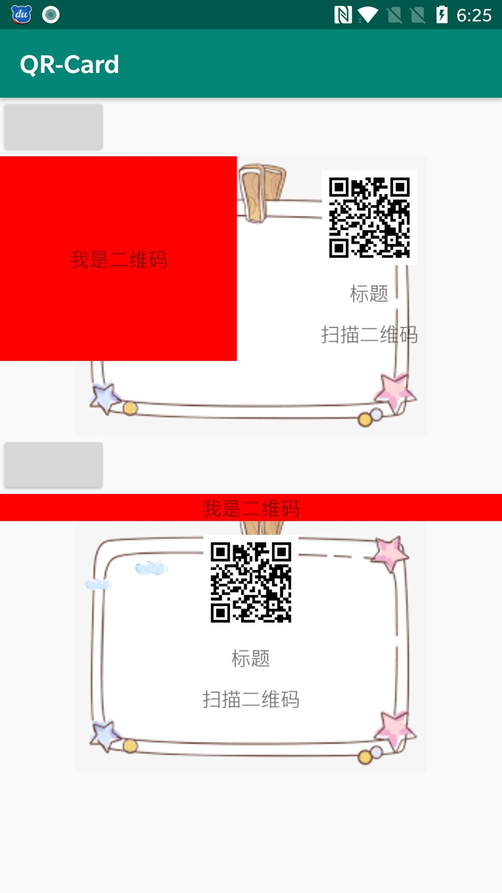

# QR-Card
动态生成二维码分享

# Usage

[](https://jitpack.io/#xieyangxuejun/QR-Card)

```
allprojects {
		repositories {
			...
			maven { url 'https://jitpack.io' }
		}
}
dependencies {
	    implementation 'com.github.xieyangxuejun:QR-Card:1.0.0-beta01'
}
```


# 动态生成二维码分享页
```
class TestViewH(context: Context) : AbsBeView<String>(context, QrEntity("我是二维码", "https://google.com", "标题", "扫描二维码")) {

    override fun onBindBodyView(view: View, data: String) {
        view.layoutParams.height = ViewGroup.LayoutParams.MATCH_PARENT
        view.tv_text.text = data
        view.setBackgroundColor(Color.RED)
    }

    override fun bindBackground(view: ImageView) {
        view.setImageResource(R.drawable.icon_bg)
    }

    override fun bindQrTitle(view: TextView) {
        //view.setTextSize(TypedValue.COMPLEX_UNIT_SP, 40f)
    }

    override fun bindQrImage(view: ImageView) {
        super.bindQrImage(view)
    }

    override fun bindQrLayout(view: View) {
        super.bindQrLayout(view)
        view.layoutParams.height = ViewGroup.LayoutParams.MATCH_PARENT
    }

    //绑定二维码msg
    override fun bindQrMsg(view: TextView) {
        super.bindQrMsg(view)
    }

    override fun getBodyLayoutId(): Int = R.layout.layout_test

    override fun adjustParams(linearLayout: LinearLayout): LinearLayout {
        return super.adjustParams(linearLayout).apply {
            orientation = LinearLayout.HORIZONTAL
            background = null
        }
    }
}
```

# Screen Shot

